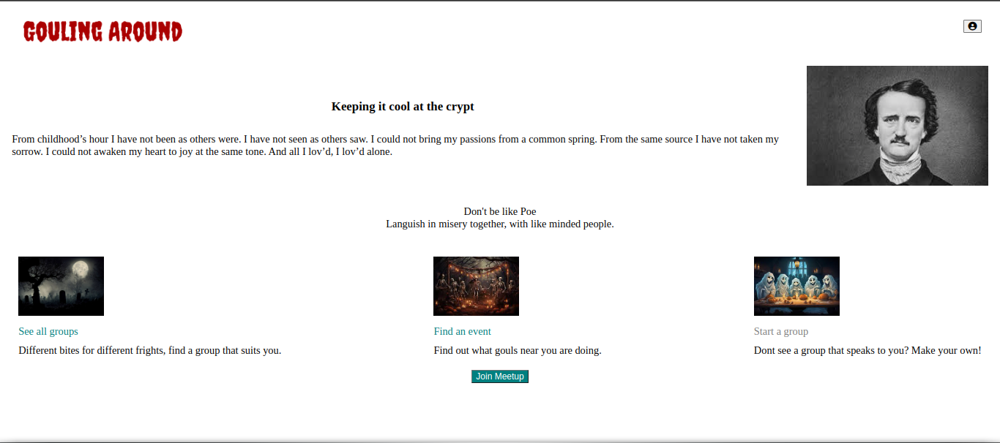
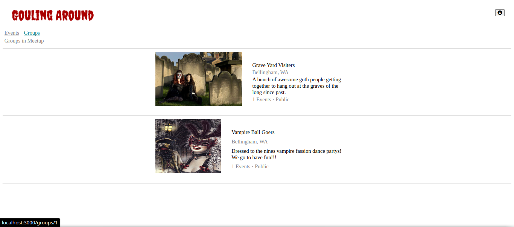
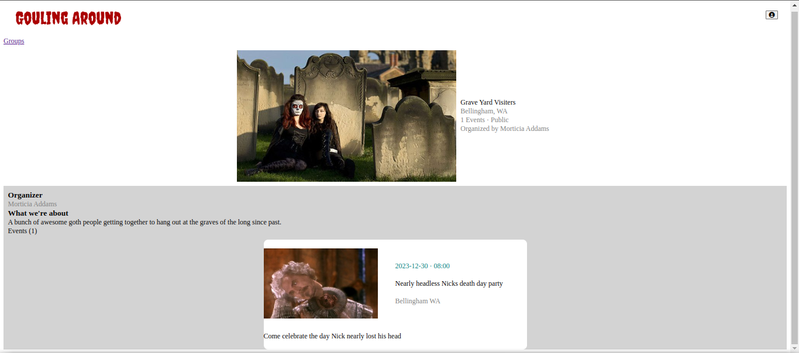

# Gouling Around

## Description

Gouling Around is an app for creating groups and hosting events. Gouling Around is a clone of [Meetup](https://www.meetup.com/).

## Link to live site

Hosted on Render: [Gouling Around](https://gouling-around.onrender.com)

## Technologies

Gouling Around was built using the following technologies:
 
 

## Getting Started

1. Clone this repo
    * `git clone https://github.com/Mboyce613/API_project`

2. Install dependencies
    * `cd backend`
    * `npm install`
    * `open a second terminal`
    * `cd frontend`
    * `npm install`

3. Create a .env file in backend directory modeled off of the .env.example from the backend directory and fill out the respective information.

4. Add a proxy to the package.json file in the frontend directory to match the PORT configuration in the .env file
    * `"proxy": "http://localhost:8000"`

5. Create Database, Migrate, and Seed models
    * `npx dotenv sequelize db:migrate`
    * `npx dotenv sequelize db:seed:all`

6. Start the backend server
    * `npm start`

7. Start the frontend server
    * `npm start`

## Images

